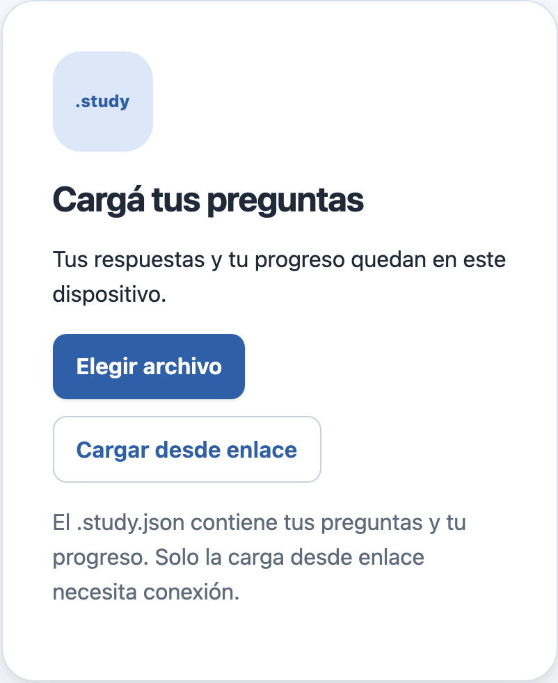
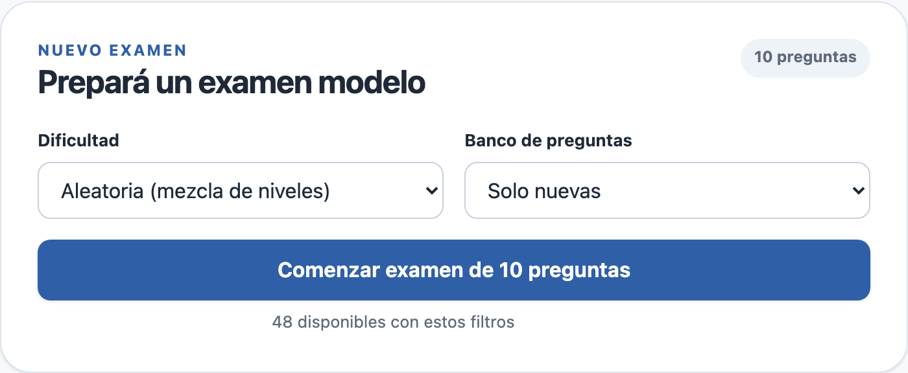
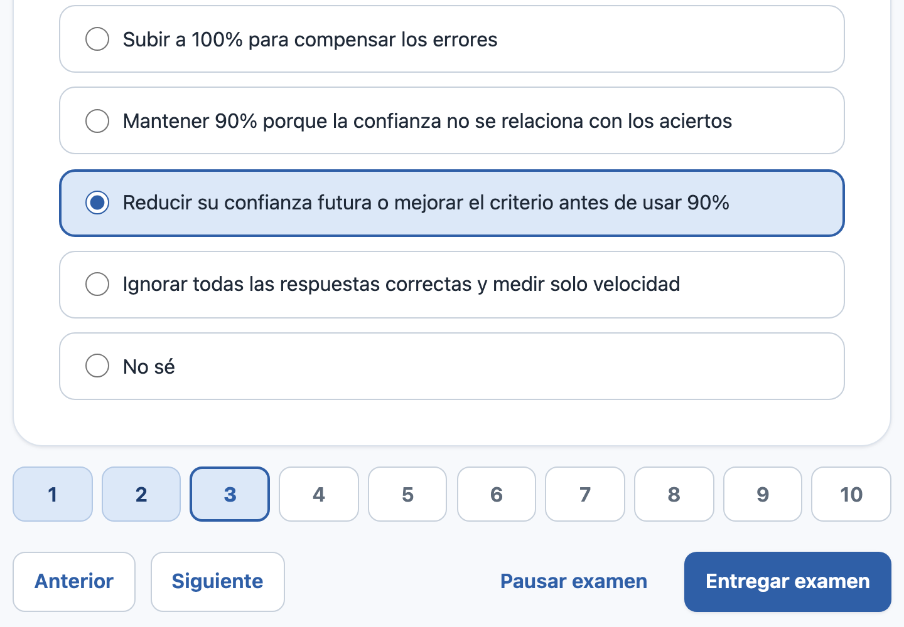
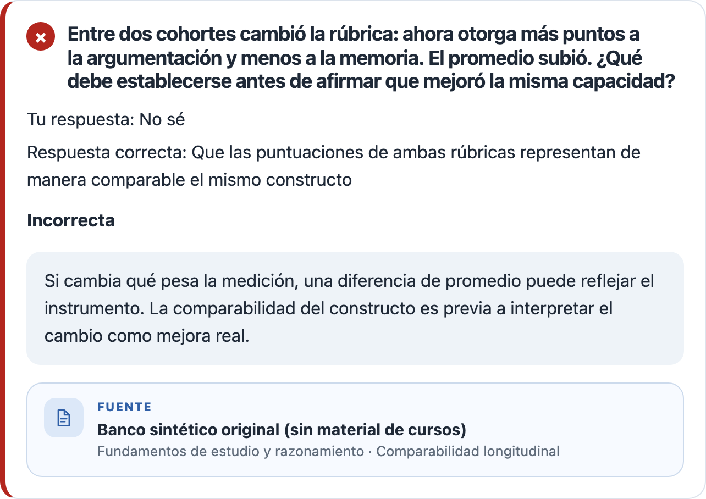
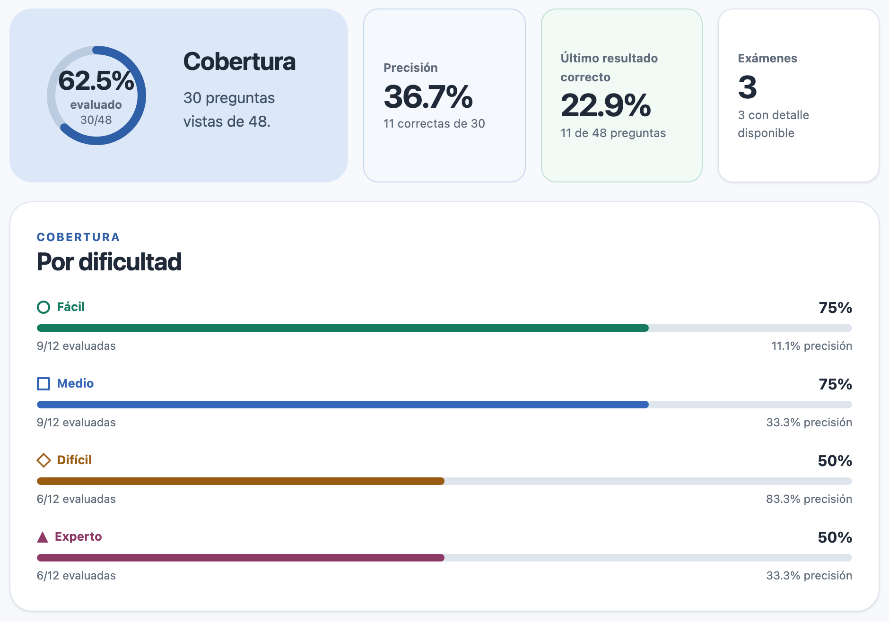
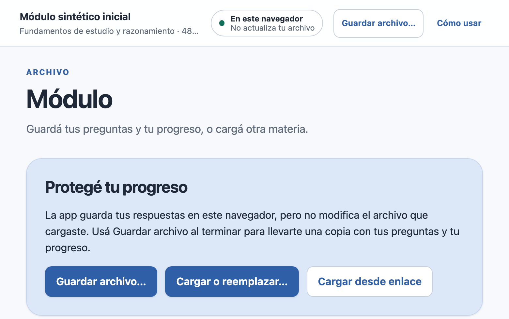
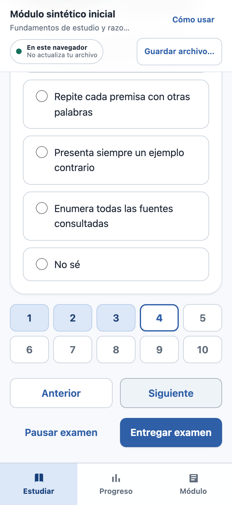

# 1. Cargá tus preguntas

Estudiá en etapas sin empezar de cero. Las capturas usan preguntas de ejemplo.

Abrí [Estudio Interactivo](https://leaabelli.github.io/estudio-interactivo/) o tu copia de `index.html`. Cada test se carga como un **módulo .study.json**: contiene preguntas y, cuando lo guardás, también tu progreso. No necesitás una cuenta.

1. **Elegir archivo:** buscá el `.study.json` que tenés en el dispositivo.
2. **Cargar desde enlace:** pegá el enlace público HTTPS al `.study.json`. Debe apuntar al archivo, no a una página que lo describe.

En ambos casos, revisá la materia y la cantidad de preguntas en la vista previa. Confirmá **Cargar módulo** para empezar.

El archivo local funciona sin internet; el enlace requiere conexión al cargar. Después estudiás en tu dispositivo: tus respuestas no se envían al sitio de origen.

> ¿Todavía no tenés un test? Mirá la página 7. Los PDF y las diapositivas no se cargan directamente. Para usar la app en iPhone, seguí la página 8.

<!-- pagebreak -->

# 2. Prepará un examen

Entrá a **Estudiar**. Cada examen tiene 10 preguntas y vos elegís cómo practicar.

1. **Dificultad.** Elegí Fácil, Medio, Difícil o Experto. Para mezclar niveles, usá **Aleatoria**.
2. **Banco de preguntas.** Elegí **Solo nuevas** para recorrer material que todavía no entregaste, o **Todas: nuevas y evaluadas** para incluir repaso.
3. Tocá **Comenzar examen de 10 preguntas**. Debajo del botón podés ver cuántas preguntas cumplen tus filtros.

### ¿Con qué conviene empezar?

Probá **Fácil + Solo nuevas** para entrar en tema. Después subí la dificultad o usá **Aleatoria**. Si querés reforzar contenidos, cambiá a **Todas: nuevas y evaluadas**: pueden salir preguntas nuevas o repetidas, no solo las que contestaste mal.

### Si quedan pocas preguntas

La app te avisa cuando no alcanza para 10. Podés cambiar los filtros o aceptar un examen más corto, si hay preguntas disponibles. Si no queda ninguna nueva, elegí otro nivel o incluí las ya evaluadas.

> Una pregunta cuenta como evaluada cuando entregás el examen, aunque la respuesta sea incorrecta. Mirarla o dejarla en un examen pausado todavía no aumenta la cobertura.

<!-- pagebreak -->

# 3. Respondé a tu ritmo

Leé el título, el enunciado y cualquier tabla, imagen o diagrama antes de elegir. La etiqueta de arriba te recuerda la dificultad.

1. Tocá una **respuesta**. Podés cambiarla mientras no hayas entregado. Si no sabés, elegí **No sé**.
2. Usá los **números** para saltar a otra pregunta. Las respondidas quedan marcadas.
3. Tocá **Anterior** o **Siguiente** para recorrer el examen. No hace falta contestar en orden.
4. Cuando termines, tocá **Entregar examen** para ver la corrección.

### Si necesitás una pausa

**Pausar examen** te lleva a Estudiar y conserva tus respuestas en este navegador. Después tocá **Reanudar examen**. Para llevarte esa pausa a otro dispositivo, usá también **Guardar archivo…**; te lo mostramos en la página 6.

Si entregás con preguntas pendientes, la app te deja volver a **Revisar respuestas** o **Entregar igual**. Las que queden vacías cuentan como **No sé** e incorrectas.

> Pausar no es abandonar: **Abandonar…** descarta las respuestas de ese examen sin corregirlas. No suma un resultado ni modifica lo que ya habías evaluado.

<!-- pagebreak -->

# 4. Aprendé de la corrección

Después de entregar vas a ver cuántas respuestas acertaste y cuántas preguntas nuevas sumaste a tu recorrido. Bajá hasta **Pregunta por pregunta**: ahí está la parte más útil para estudiar.

1. Compará **Tu respuesta** con **Respuesta correcta**. La app indica si acertaste o no.
2. Leé la **explicación**, incluso cuando hayas acertado. Te ayuda a distinguir una respuesta segura de una que elegiste por descarte.
3. Mirá la **fuente**, cuando esté incluida. Te orienta hacia el material del que salió la pregunta: por ejemplo, una clase, página o ejercicio.

Las tablas, imágenes y diagramas vuelven a aparecer en la corrección. Las fuentes se muestran después de entregar, para no darte pistas durante el examen.

### ¿Y ahora?

Si hubo varios errores, repasá primero sus explicaciones y el material citado. Si querés seguir practicando, tocá **Nuevo examen**. Para ver cómo se suma este intento a los anteriores, tocá **Ver progreso**.

> Repetir preguntas también sirve: puede mejorar tus aciertos aunque no aumente la cobertura. La cobertura solo crece cuando entregás preguntas que nunca habías evaluado.

<!-- pagebreak -->

# 5. Mirá cómo venís

Entrá a **Progreso** para ver el conjunto de tus exámenes. No te quedes con un solo porcentaje: cada indicador responde una pregunta distinta.

1. **Cobertura:** ¿cuánto del banco recorriste? Si evaluaste 20 preguntas distintas de un banco de 100, tenés 20 % de cobertura.
2. **Precisión:** ¿cuánto acertás? Si acertaste 7 de 10 respuestas entregadas, tu precisión es 70 %. Los siguientes exámenes también cuentan en este porcentaje.
3. **Por dificultad:** ¿qué niveles te faltan recorrer? Compará las barras y los aciertos para decidir qué practicar después.

**Último resultado correcto** muestra qué parte del banco tiene un acierto como resultado más reciente. No es una nota de la materia: todavía puede haber preguntas sin practicar.

Más abajo encontrás la evolución de los últimos exámenes y el historial. Las barras muestran los aciertos de cada examen; la línea, cuánto del banco llevabas evaluado al terminarlo.

> Mucha cobertura y pocos aciertos: dedicá tiempo al repaso. Muchos aciertos y poca cobertura: seguí con preguntas nuevas antes de sacar conclusiones sobre toda la materia.

<!-- pagebreak -->

# 6. Guardá y continuá después

La app recuerda tus respuestas en este navegador. **No actualiza el archivo ni el sitio del que vino el test.** Para llevarte el avance a otro dispositivo, guardá una copia nueva.

1. Al terminar una sesión, tocá **Guardar archivo…**. El archivo incluye las preguntas, los resultados y cualquier examen pausado.
2. Para retomar desde ese archivo, usá **Cargar o reemplazar…** en **Módulo**, o **Elegir archivo** si estás en la pantalla de inicio.

Si aparece **Archivo guardado**, la escritura terminó. Si dice **Descarga iniciada**, comprobá que el archivo esté en Descargas. Conservá la copia más reciente: volver al archivo o enlace original no recupera tu avance.

### Volver en el mismo dispositivo

Al abrir la app, podés encontrar tus copias locales. Tocá **Abrir** en la materia que quieras continuar y, si quedó un examen pendiente, **Reanudar examen**.

### Cambiar de dispositivo o de materia

Copiá el último `.study.json` al otro dispositivo y cargalo allí. Cada materia tiene su propio archivo. Antes de reemplazar la que está abierta, la app te pide guardar una copia para protegerla.

> Los archivos con progreso contienen tus respuestas y resultados. Si los compartís, compartís también ese historial. Conservá aparte el archivo original que recibiste sin progreso.

<!-- pagebreak -->

# 7. Sumá tus propios tests

La app sirve para distintas materias, pero **no crea preguntas ni convierte documentos por sí sola**. Para agregar un test, necesitás que un docente, una persona o un asistente de IA prepare un archivo compatible `.study.json`.

### Qué conviene entregar

- **El material:** apuntes, diapositivas, ejercicios o bibliografía que podés compartir.
- **El alcance:** materia, temas que entran y temas que querés dejar afuera.
- **La cantidad:** un número por dificultad, o un total repartido entre los cuatro niveles.
- **El estilo:** preguntas de conceptos, casos, cálculos o una combinación. Pedí tablas, imágenes o diagramas cuando ayuden a responder.

### Un pedido que podés copiar

> Prepará un test para Estudio Interactivo sobre [materia y temas], usando el material adjunto. Quiero 100 preguntas: 25 fáciles, 25 medias, 25 difíciles y 25 expertas. Cada una debe tener una sola respuesta correcta, una explicación y una referencia al material. Incluí tablas o imágenes cuando hagan falta. Entregame un archivo .study.json compatible, validado y sin progreso inicial. Si el material no alcanza para esa cantidad, avisame qué falta en lugar de inventar preguntas.

Si preferís una distribución aleatoria, reemplazá la cantidad por: **“Quiero 100 preguntas con una distribución aleatoria equilibrada entre las cuatro dificultades. Indicame cuántas quedaron en cada nivel.”**

### Antes de empezar a estudiar

Compartile a quien lo prepare las [instrucciones para crear tests compatibles](https://github.com/leaabelli/estudio-interactivo/blob/main/.agents/skills/generador-modulos-preguntas/SKILL.md), junto con tu pedido y el material. Esa referencia es para quien crea el archivo; vos no necesitás entenderla. No alcanza con cambiarle el nombre a un documento: debe usar el formato que la app entiende.

Cargalo, revisá la materia y la cantidad de preguntas, y hacé un examen de prueba. Comprobá algunas respuestas contra tus fuentes, sobre todo si usaste IA. Si encontrás una pregunta dudosa, enviá el título y la observación a quien preparó el test.

> Guardá una copia del archivo original sin progreso. Después, usá tus copias actualizadas para continuar estudiando. No necesitás programar ni editar el archivo a mano.

<!-- pagebreak -->

# 8. Usalo desde el celular

En iPhone o iPad, abrí el **enlace de la app en Safari**. En Android, usá Chrome. Cargá tu archivo o enlace de preguntas.

Tocá una opción y bajá para avanzar. Deslizá las tablas anchas hacia los costados o girá el celular.

### ¿Algo no funciona?

- **WhatsApp o Archivos no responden:** salí de la vista previa y abrí el enlace web en Safari. Necesitás conexión para abrir el sitio.
- **No carga el test:** si falla el enlace, descargá el `.study.json` y usá **Elegir archivo**. Si tampoco funciona, enviá el error a quien lo preparó.
- **No aparece tu avance:** cargá el último archivo que guardaste, no el original.
- **Aviso de guardado o de otra pestaña:** guardá un archivo de respaldo y continuá en una sola pestaña.

> La rutina que cuida tu estudio: cargar, practicar, revisar y **Guardar archivo…** antes de cerrar.
